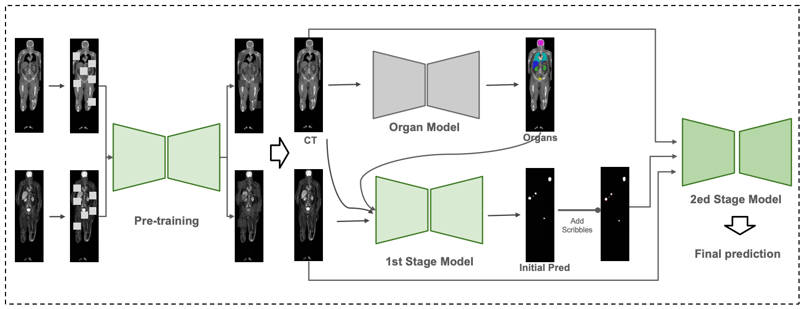

# MEDAI — Tracer-Aware Interactive Segmentation for AutoPET V

**MEDAI**'s submission to the [AutoPET V challenge](https://autopet-v.grand-challenge.org/) (interactive
lesion segmentation in whole-body PET/CT). The pipeline pairs a self-supervised masked-autoencoder-pretrained 3D
[STU-Net](https://github.com/uni-medical/STU-Net) backbone with tracer-specific (FDG/PSMA) branches, an
anatomical organ prior, and a second interactive stage that refines the initial prediction from sparse
corrective scribbles — built inside a modified [nnU-Net v2.2](https://github.com/MIC-DKFZ/nnUNet) framework.

**Paper:** [arXiv:2608.30844](https://arxiv.org/abs/2608.30844)

> **Looking for the Docker container, trained weights, or build instructions? See [`submission/`](submission/).**


## Pipeline overview



**During development:**

1. **Pretraining** (`pretraining/`): a 3D masked-autoencoder (`STUNet_MAE`) learns general PET/CT
   representations before any lesion labels are used, masking CT and PET **independently** (asynchronous
   masking) so the encoder must exploit cross-modal, not just spatial, redundancy.
2. **Organ segmentation model**: trained on CT to predict anatomical organ masks, giving Stage 1 explicit
   anatomical context to help distinguish physiological uptake from malignant lesions.
3. **Stage 1 — initial segmentation** (`stage1_lesion_segmentation/`): the encoder is initialized from the
   MAE-pretrained checkpoint, then fine-tuned on CT + PET + the predicted organ mask (3 input channels) with a
   3-phase curriculum schedule to produce an initial lesion mask.
4. **Stage 2 — interactive refinement** (`stage2_interactive_refinement/`): a random number (1–5) of simulated
   scribbles are generated each iteration and combined with the Stage‑1 prediction as a third input channel
   alongside CT and PET; a second network, initialized from the finished Stage‑1 checkpoint, is trained to
   incorporate them.

**During inference:**

1. **Tracer classification** (`tracer_classification/`): each study is classified as FDG or PSMA using the
   pretrained classifier published by [Kalisch et al.](https://github.com/hakal104/autoPETIII/) for their
   AutoPET III submission — see that folder for details and citation.
2. **Stage 1**: the tracer-specific Stage‑1 model produces the initial lesion mask.
3. **Stage 2**: the tracer-specific Stage‑2 model refines it using interactive scribbles.

FDG and PSMA share the same architecture and training pipeline end to end but are trained and run fully
independently, to account for tracer-specific appearance and error modes.


**Model Checkpoints:** trained weights, the Dockerfile, and the exact inference code
that produced our final-test-set submission are in [`submission/`](submission/) —
see [`submission/README.md`](submission/README.md) for the per-model fold list and
build instructions. Weights are hosted externally (linked there) and fetched by
`submission/download_weights.sh`; they aren't committed to this repo directly.
<!-- ## Data

Trained and evaluated on the official AutoPET V training data only (no external imaging data):

| Tracer | Studies | Patients | Source | Cohort |
|---|---|---|---|---|
| FDG | 1,014 | 900 | University Hospital Tübingen | Malignant melanoma, lymphoma, lung cancer, and negative controls |
| PSMA | 597 | 378 | LMU University Hospital Munich | Prostate cancer, with and without PSMA-avid lesions |

Each study is a co-registered whole-body CT + PET (SUV) volume pair with a binary manual lesion mask, provided
in nnU-Net's NIfTI format (CT/PET as separate channels). Preprocessing uses nnU-Net's default planning, with
tracer-specific target spacing/patch size chosen automatically by the planner:

| Tracer | Target spacing (mm) | Patch size |
|---|---|---|
| FDG | 3.0 × 2.03 × 2.03 | 128 × 128 × 128 |
| PSMA | 4.07 × 3.27 × 4.07 | 112 × 192 × 112 |

## Repository layout

```
.
├── pretraining/                     Stage 0 — self-supervised MAE pretraining (standalone, not part of nnU-Net)
│   ├── dataloader.py                    NPZDataset: loads preprocessed CT/PET patches
│   ├── model_asynchronous.py            STUNet_MAE model definition
│   └── train_asynchronous.py            Training script (single-GPU or DDP)
│
├── tracer_classification/           Stage — FDG/PSMA routing via Kalisch et al.'s pretrained classifier (see its README)
├── organ_segmentation/              Auxiliary anatomical prior (not included in this snapshot, see its README)
│
├── stage1_lesion_segmentation/      Stage 1 — initial lesion segmentation (wrapper scripts + docs)
├── stage2_interactive_refinement/   Stage 2 — scribble-guided refinement (wrapper scripts + docs)
├── submission/                      Grand Challenge inference container: Dockerfile, entrypoint code,
│                                    weights download script - see submission/README.md
└── nnUNet-2.2/                      Forked nnU-Net v2.2 with STU-Net + curriculum + interactive additions
    └── nnunetv2/
        ├── run/run_finetuning_stunet.py                    Fine-tuning entry point (loads pretrained weights)
        ├── training/dataloading/data_loader_3d_interactive.py   Skeleton-based scribble simulation
        └── training/nnUNetTrainer/    STU-Net backbones + curriculum-scheduled trainers (Stage 1 & 2)
```

See [`nnUNet-2.2/readme.md`](nnUNet-2.2/readme.md) for exactly what was changed relative to upstream nnU-Net,
and [`pretraining/README.md`](pretraining/README.md) for pretraining usage.

## Setup

Requires Python >= 3.9 and a CUDA-capable GPU (pretraining and fine-tuning are both 3D and memory-hungry).

```bash
# 1. Install the (modified) nnU-Net framework in editable mode
pip install -e nnUNet-2.2

# 2. Install additional dependencies used by the pretraining scripts
pip install -r requirements.txt
```

## Usage

### 1. Pretrain the MAE encoder

```bash
python pretraining/train_asynchronous.py \
    --data_dir /path/to/nnUNet_preprocessed/DatasetXXX/.../fold_all \
    --save_dir /path/to/pretrain_output \
    --epochs 500 --lr 1e-4 --batch 4 --mask_ratio 0.5
```

See [`pretraining/README.md`](pretraining/README.md) for all arguments.

### 2. Stage 1 — initial segmentation

```bash
nnUNetv2_plan_and_preprocess -d DATASET_ID --verify_dataset_integrity
stage1_lesion_segmentation/train_fdg.sh DATASET_ID FOLD /path/to/pretrain_output/checkpoint.pth
```

See [`stage1_lesion_segmentation/README.md`](stage1_lesion_segmentation/README.md).

### 3. Stage 2 — interactive refinement

```bash
stage2_interactive_refinement/train_fdg.sh DATASET_ID FOLD /path/to/stage1/fold_F/checkpoint_final.pth
```

See [`stage2_interactive_refinement/README.md`](stage2_interactive_refinement/README.md).

### 4. Ensemble and predict

```bash
nnUNetv2_predict -i INPUT_FOLDER -o OUTPUT_FOLDER -d DATASET_ID -c 3d_fullres -tr MyCustomCurriculumTrainerSegPre --save_probabilities
nnUNetv2_ensemble -i FOLD0_OUT FOLD1_OUT ... -o ENSEMBLE_OUT
```

FDG and PSMA are ensembled separately (never mixed), since each tracer branch is trained independently
end to end.

## Results

10-fold cross-validation Dice on the official AutoPET V training split.

**Stage 1** (initial segmentation):

| Fold | FDG Dice | PSMA Dice |
|---|---|---|
| 0 | 0.5534 | 0.5990 |
| 1 | 0.5750 | 0.5343 |
| 2 | 0.6551 | 0.5949 |
| 3 | 0.5124 | 0.5712 |
| 4 | 0.6464 | 0.5579 |
| 5 | 0.6365 | 0.6074 |
| 6 | 0.6221 | 0.5966 |
| 7 | 0.5642 | 0.6234 |
| 8 | 0.5093 | 0.6025 |
| 9 | 0.6145 | 0.5459 |
| **Mean ± Std.** | **0.5889 ± 0.0537** | **0.5833 ± 0.0293** |

**Stage 2** (after interactive refinement) — evaluation is still in progress; folds not yet run are blank:

| Fold | FDG Dice | PSMA Dice |
|---|---|---|
| 0 | 0.5604 | 0.6717 |
| 1 | 0.6278 | 0.6134 |
| 2 | 0.6621 | 0.6383 |
| 3 | 0.5565 | 0.5937 |
| 4 | — | 0.6153 |
| 5 | 0.6393 | 0.6853 |
| 6 | 0.6766 | — |
| 7 | 0.6270 | 0.6340 |
| 8 | 0.5630 | 0.6357 |
| 9 | 0.6446 | 0.6562 |

Final test-set performance will be added after the challenge evaluation.

## License

Apache License 2.0 — see [`LICENSE`](LICENSE). This project is based on
[nnU-Net](https://github.com/MIC-DKFZ/nnUNet) and [STU-Net](https://github.com/uni-medical/STU-Net), also
Apache 2.0 licensed. Tracer routing uses the MIT-licensed classifier from
[hakal104/autoPETIII](https://github.com/hakal104/autoPETIII/) (see [`tracer_classification/README.md`](tracer_classification/README.md)). -->
